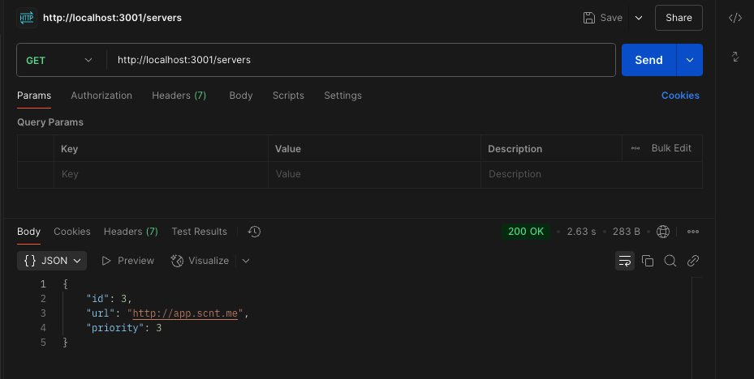

[](https://opensource.org/licenses/MIT)

# Scentronix - Full-stack assignment

## Table of Contents

- [1. General Information](#1-general-information)
- [2. Main Features](#2-main-features)
- [3. Installation and Setup Instructions](#3-installation-and-setup-instructions)
- [4. Libraries](#4-libraries)

## 1. General Information

This repository contains source code for **Back End part of Scentronix Full-stack Assignment**.

Check out requirements [here](https://gitlab.com/scentronix/assessments/web-interviews/-/tree/master/fullstack?ref_type=heads#front-end-part).

## 2. Main Features

- Get Server Endpoint.



## 3. Installation and Setup Instructions

- Clone the project repository into your local device and move into the project folder:

```bash
$ git clone git@github.com:ntbinh91/scentronix-assessment.git
$ cd scentronix-assessment/back-end
```

- Project setup:

```bash
$ yarn install
```

- Compile and run the project:

```bash
# development
$ yarn run start

# watch mode
$ yarn run start:dev

# production mode
$ yarn run start:prod
```

- The API endpoint will be served at [http://localhost:3001](http://localhost:3000).

## 4. Libraries

- [NestJS](https://nestjs.com/)
- [@nestjs/axios](https://www.npmjs.com/package/@nestjs/axios)
- [@nestjs/config](https://www.npmjs.com/package/@nestjs/config)
