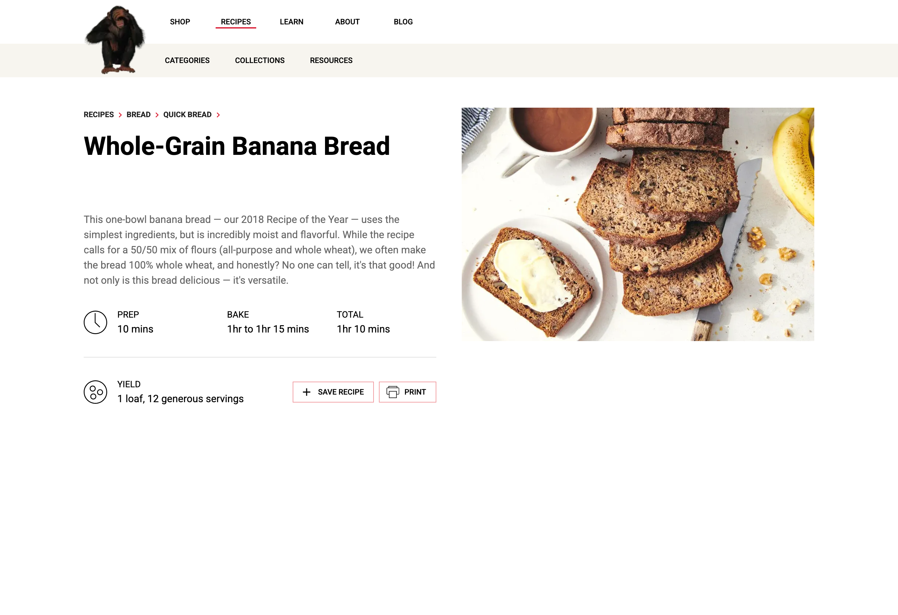
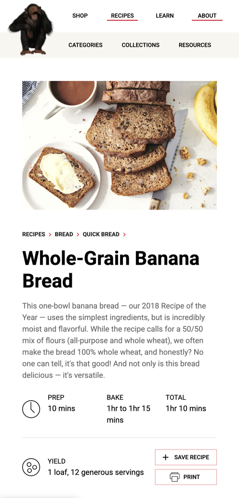

[](https://opensource.org/licenses/MIT)

# Scentronix - Full-stack assignment

## Demo

A running demo of the site here: [DEMO](https://scentronix-assessment-rho.vercel.app/recipes)

## Table of Contents

- [1. General Information](#1-general-information)
- [2. Main Features](#2-main-features)
- [3. Installation and Setup Instructions](#3-installation-and-setup-instructions)
- [4. Libraries](#4-libraries)

## 1. General Information

This repository contains source code for **Front End part of Scentronix Full-stack Assignment**.

Check out requirements [here](https://gitlab.com/scentronix/assessments/web-interviews/-/tree/master/fullstack?ref_type=heads#front-end-part).

## 2. Main Features

- Recipe detail screen.
- Initiate some other empty screens for navigating testing purpose.

All screens were handled responsive layout and fetched data from a mock API.

|                                                              |                                                              |
| ------------------------------------------------------------ | ------------------------------------------------------------ |
|  |  |

## 3. Installation and Setup Instructions

- Clone the project repository into your local device and move into the project folder:

```
$ git clone git@github.com:ntbinh91/scentronix-assessment.git
$ cd scentronix-assessment/front-end
```

- Install libraries:

```
$ yarn install
```

- Launch local development server:

```
$ yarn dev
```

- Open a browser and access to [http://localhost:3000](http://localhost:3000) to access to development server.

## 4. Libraries

- [NextJS v15](https://nextjs.org/)
- [React v19](https://react.dev/blog/2024/12/05/react-19)
- [Material UI](https://mui.com/material-ui/)
